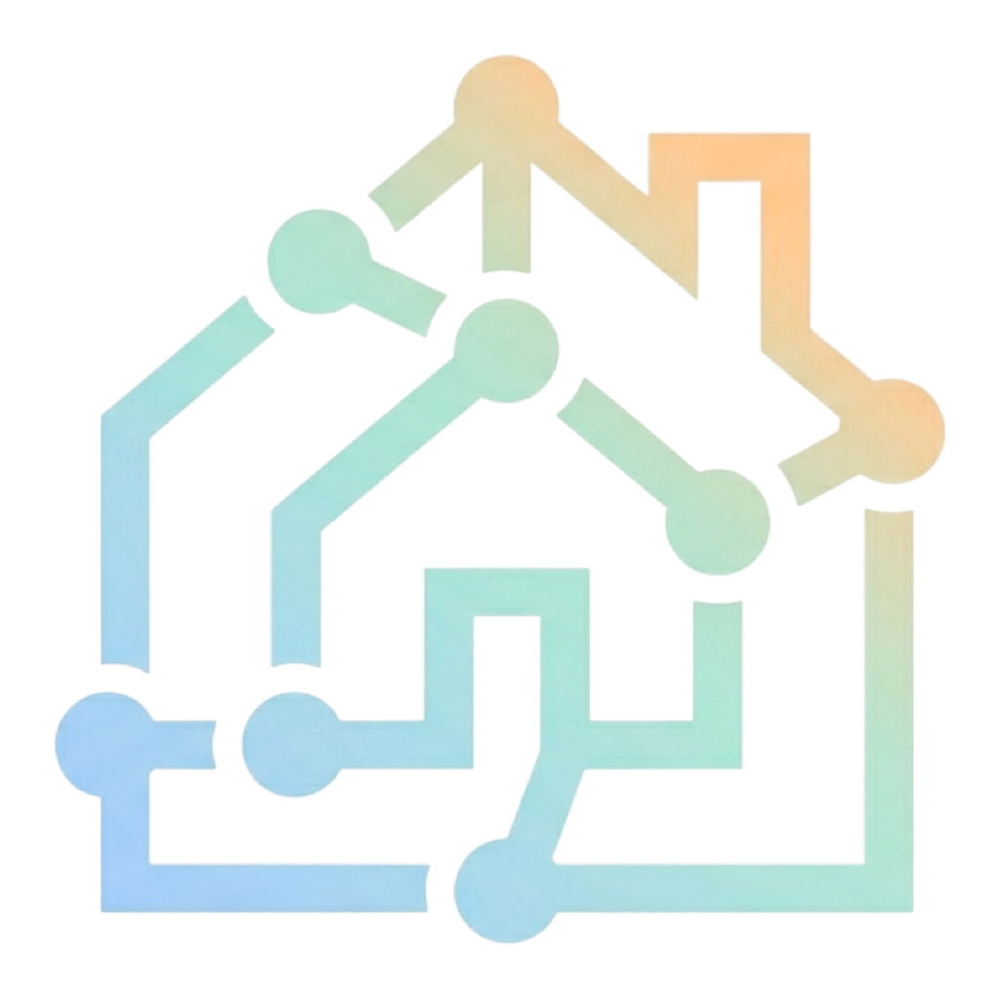
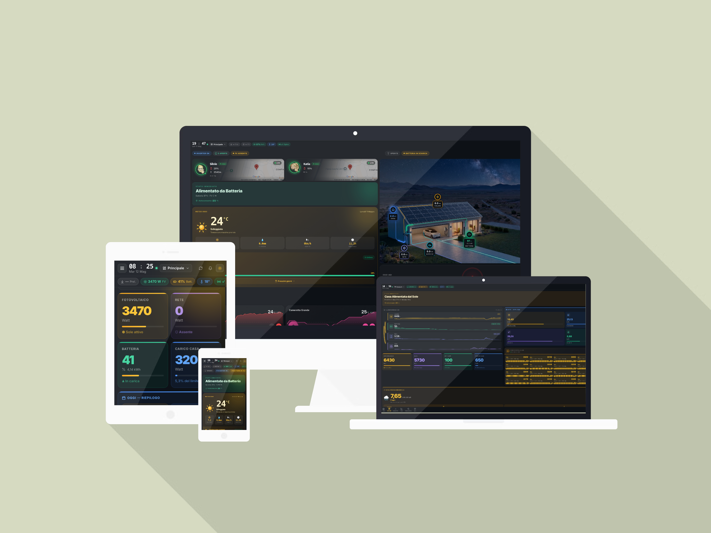

<div align="center">



# Oikos

**The composable Home Assistant dashboard — build anything, no YAML, no code.**

[](https://github.com/Bobsilvio/oikos/releases)
[](https://www.home-assistant.io)
[](#-license--licenza)
[](https://github.com/Bobsilvio/oikos/discussions)

[](https://homeoikos.com/)

[](https://my.home-assistant.io/redirect/supervisor_add_addon_repository/?repository_url=https%3A%2F%2Fgithub.com%2FBobsilvio%2Foikos)

[](#-installazione)

🐳 **Disponibile anche per Docker / HA Container** — vedi [Installazione → Metodo 3](#-installazione) · [English](#-installation) · [`docker-compose.example.yml`](docker-compose.example.yml)

[🇮🇹 Italiano](#-italiano) · [🇬🇧 English](#-english)

</div>

---

## 📸 Preview

<div align="center">



</div>

---

## 🇮🇹 Italiano

Oikos trasforma Home Assistant in una **dashboard visuale componibile**. Tutto quello che vedi è modificabile: disponi le card come vuoi, creane di nuove con drag & drop, costruisci viste personalizzate dal browser. Zero YAML, zero codice.

### ✨ Cosa rende Oikos diverso

| | |
|---|---|
| 🃏 **Smart Card builder** | Crea card visive combinando widget (testi, icone, gauge, grafici, valori HA) — posizionali con drag & drop come in Figma |
| 🤖 **AI Card Builder** | Descrivi la card che vuoi a **Claude Code** — lui la scrive, tu la incolli nello store. Dashboard personalizzata in minuti |
| 🔁 **Retrocompatibilità totale** | Hai già card HACS o Lovelace (Mushroom, Bubble, card-mod…)? Funzionano dentro Oikos — basta incollare il YAML |
| 🖥️ **Screen saver** | Modalità screen saver personalizzabile — si attiva automaticamente per inattività, mantieni i tuoi display fissi sempre vivi e belli |
| 🏪 **Community store** | Installa card create da altri utenti da GitHub, con aggiornamenti automatici |
| ⚡ **Live energia** | Flusso energia in tempo reale: fotovoltaico, rete, batteria, casa — diagramma animato |
| 🌤️ **Meteo dinamico** | Sfondo che cambia con le condizioni: sereno, nuvoloso, pioggia, notte |
| 🔔 **Popup automatici** | Avvisi configurabili per orario, condizione HA o manuale |
| 🌙 **Dark / Light** | Tema automatico alba/tramonto o manuale |
| 📱 **Responsive** | Layout ottimizzato per mobile, tablet e desktop |

---

### 🤖 Crea card con Claude Code — in pochi minuti

Oikos espone un **SDK pubblico** compatibile con Claude Code. Non devi sapere React o JavaScript: descrivi la card che ti serve e Claude la scrive per te.

```
"Crea una card Oikos che mostra la temperatura del soggiorno,
un grafico sparkline delle ultime 24h e un badge rosso
se la finestra è aperta."
```

Claude genera il file `.js` completo, tu lo carichi nello store di Oikos. Fine.

> Funziona anche per card complesse: grafici storici, controlli interattivi, layout multi-colonna, animazioni.

**Per iniziare:**
```bash
git clone https://github.com/Bobsilvio/oikos-card-starter
cd oikos-card-starter
claude
```
Lo `SKILL.md` nella root viene caricato automaticamente — Claude sa già tutto del build system e dell'SDK.

📘 Documentazione SDK: [SKILL.md](https://github.com/Bobsilvio/oikos-card-starter/blob/main/SKILL.md) · esempi reali in [oikos-cards](https://github.com/Bobsilvio/oikos-cards)

---

### 🔁 Le tue card HACS e Lovelace funzionano già

Hai investito anni a configurare Mushroom, Bubble Card, ApexCharts, Mini Graph Card, custom:button-card? **Non devi buttare niente.**

Oikos include la **Card YAML** — incolla il YAML di qualsiasi card Lovelace e la vedi live nell'editor. Continui ad usare tutto quello che hai già, dentro un'interfaccia moderna. La migrazione è graduale: tieni le vecchie card dove vuoi e aggiungi quelle nuove quando sei pronto.

---

### 🖥️ Screen saver

Oikos può funzionare come **screen saver intelligente** per tablet fissi e pannelli a parete. Dopo un periodo di inattività configurabile, la dashboard entra in modalità schermo intero con contenuti personalizzati — meteo, orologio, flusso energia — mantenendo il display sempre attivo e visivamente impeccabile.

---

### 🃏 Card integrate

#### ⚡ Energia
| Card | Descrizione |
|------|-------------|
| **Bolletta Energia** 🇮🇹 ⭐ | Stima bolletta mensile ARERA (fasce F1/F2/F3) — breakdown 4 voci, storico 6 mesi, live W |
| **Live Energia** | Potenze istantanee: rete, fotovoltaico, batteria, carico casa |
| **Flusso Energia** | Diagramma flusso animato casa ↔ rete ↔ FV ↔ batteria con grafico storico |
| **Stato Immediato** | KPI energetici del momento in tempo reale |
| **Riepilogo Oggi** | Produzione FV, consumo, autoconsumo, risparmio — totali del giorno |
| **Previsione Domani** | Stima kWh produzione, condizioni meteo, qualità fascia oraria |
| **Flusso su Immagine** | Nodi energia animati sovrapposti a planimetria o foto impianto |

> **Bolletta Energia** richiede impianto FV configurato e il package [Calcolo Bolletta](https://ko-fi.com/s/ee740d920c) installato su HA (`sensor.sm_bolletta_*`). Disponibile solo con **licenza attiva** (non nel periodo di prova). Calibrata per il mercato italiano (ARERA/GSE) — non compatibile con mercati esteri.

#### 🏠 Casa
| Card | Descrizione |
|------|-------------|
| **Stanza** | Temp, umidità, sparkline 24h, badge luci/tapparelle/sensori |
| **Luci** | Controllo rapido luci configurate in HA |
| **Batterie** | Stato carica raggruppato in 4 fasce (Critico/Basso/Medio/Pieno) |
| **Auto / Wallbox** | Batteria EV, potenza wallbox live, switch on/off ricarica |
| **Tesla** | Batteria, autonomia, ricarica live (kW / kWh / ETA), pressione gomme, Sentry, porte |
| **Elettrodomestici** | Consumo watt con barra e colore adattivi (spento/standby/attivo/piena potenza) |
| **Lista Entità** | Lista configurabile con icona, nome, valore e colori per riga |

#### 🌤️ Meteo
| Card | Descrizione |
|------|-------------|
| **Meteo** | Condizioni attuali con stima produzione solare giornaliera |
| **Meteo + Previsioni** | Temp, umidità, vento, pressione + forecast 5 giorni — non richiede FV |

#### 🔧 Custom
| Card | Descrizione |
|------|-------------|
| **Smart Card** | Card visuale con widget SVG posizionabili in drag & drop |
| **Card YAML** | Incolla YAML di qualsiasi card Lovelace / HACS con anteprima live |
| **HTML Card** | Iframe con contenuto HTML personalizzato |
| **Popup Panel** | Pannello popup contenente altre card — aperto al click o da trigger automatico |

#### ⭐ Community Premium
| Card | Descrizione |
|------|-------------|
| **Zigbee Watchdog** | Monitor dispositivi Zigbee: last-seen, link quality, alert dispositivi caduti |

Le card premium si installano dallo **Store → Community** di Oikos. Riservate agli abbonati attivi.

---

### 🚀 Installazione

**Metodo 1 — Badge (consigliato)**

Clicca il badge **"Add to Home Assistant"** in cima alla pagina — si apre direttamente HA con il repository precompilato.

**Metodo 2 — Manuale**

1. **Impostazioni → Applicazioni → Store applicazioni**
2. Menu **⋮ → Repositories** → incolla `https://github.com/Bobsilvio/oikos`
3. Chiudi, ricarica → cerca **Oikos** → **Installa**
4. Avvia l'applicazione e segui il wizard di configurazione iniziale

**Metodo 3 — Docker (HA Container)**

Per chi usa HA in Docker puro (senza applicazioni). Oikos gira come container separato che condivide il `/config` di HA:

```yaml
services:
  oikos:
    image: ghcr.io/bobsilvio/oikos:standalone
    container_name: oikos
    restart: unless-stopped
    ports: ["3564:3564"]
    volumes:
      - /percorso/al/config/homeassistant:/config   # lo STESSO /config di HA
    environment:
      OIKOS_STANDALONE: "1"
      OIKOS_HA_URL: "http://192.168.1.50:8123"        # IP locale del tuo HA
```

`docker compose up -d` → **riavvia HA una volta** (Oikos aggiunge da solo la voce in sidebar e il ponte di accesso remoto) → apri **Oikos**. Funziona anche da remoto (Nabu Casa).

**Requisiti:** Home Assistant OS / Supervised / Container · HA 2024.1+ · `amd64`, `aarch64`, `armv7`, `armhf`, `i386` · ~200 MB RAM

---

### 🔑 Licenza e abbonamento

**40 giorni di prova gratuita** al primo avvio, senza carta di credito.
Dopo il trial è richiesto un abbonamento. Licenza nominale (legata all'email), copre **1 installazione HA**. Gestione dal portale integrato nell'app (Stripe o PayPal).

---

### 💬 Community e supporto

| | |
|---|---|
| 🐛 **Bug** | [Apri un'Issue](https://github.com/Bobsilvio/oikos/issues/new/choose) |
| 💡 **Idee & domande** | [GitHub Discussions](https://github.com/Bobsilvio/oikos/discussions) |
| 🇮🇹 **Supporto italiano** | [Discussioni in italiano](https://github.com/Bobsilvio/oikos/discussions/categories/italiano) |
| 📦 **Contribuire card** | [CONTRIBUTING.md](CONTRIBUTING.md) · [oikos-cards](https://github.com/Bobsilvio/oikos-cards) |
| 📖 **Wiki** | [Documentazione completa](https://github.com/Bobsilvio/oikos/wiki) |

---

## 🇬🇧 English

Oikos turns Home Assistant into a **composable visual dashboard**. Everything you see is customizable — arrange cards your way, create new ones with drag & drop, build personalized views right from the browser. Zero YAML, zero code.

### ✨ What makes Oikos different

| | |
|---|---|
| 🃏 **Smart Card builder** | Create visual cards by combining widgets (text, icons, gauges, charts, HA values) — place them with drag & drop, Figma-style |
| 🤖 **AI Card Builder** | Describe the card you want to **Claude Code** — it writes the code, you paste it into the store. Custom dashboard in minutes |
| 🔁 **Full backwards compatibility** | Already have HACS or Lovelace cards (Mushroom, Bubble, card-mod…)? They work inside Oikos — just paste the YAML |
| 🖥️ **Screen saver** | Customizable screen saver mode — activates automatically on idle, keeps wall-mounted tablets and fixed displays always alive |
| 🏪 **Community store** | Install cards published by other users from GitHub, with automatic updates |
| ⚡ **Live energy** | Real-time energy flow: solar, grid, battery, home — animated diagram |
| 🌤️ **Dynamic weather** | Background that changes with conditions: clear, cloudy, rain, night |
| 🔔 **Auto popups** | Alerts triggered by time, HA entity state or manually |
| 🌙 **Dark / Light** | Automatic sunrise/sunset theme or manual toggle |
| 📱 **Responsive** | Optimized layout for mobile, tablet and desktop |

---

### 🤖 Build cards with Claude Code — in minutes

Oikos ships with a **public SDK** fully compatible with Claude Code. No React or JavaScript knowledge required — just describe the card you need.

```
"Create an Oikos card that shows the living room temperature,
a 24h sparkline chart, and a red badge if the window is open."
```

Claude generates the complete `.js` file, you upload it to the Oikos store. Done.

> Works for complex cards too: historical charts, interactive controls, multi-column layouts, animations.

**To get started:**
```bash
git clone https://github.com/Bobsilvio/oikos-card-starter
cd oikos-card-starter
claude
```
The `SKILL.md` in the root is loaded automatically — Claude already knows the full build system and SDK.

📘 SDK docs: [SKILL.md](https://github.com/Bobsilvio/oikos-card-starter/blob/main/SKILL.md) · real-world examples at [oikos-cards](https://github.com/Bobsilvio/oikos-cards)

---

### 🔁 Your existing HACS and Lovelace cards work as-is

Already set up Mushroom, Bubble Card, ApexCharts, Mini Graph Card, custom:button-card? **Nothing goes to waste.**

Oikos includes the **YAML Card** — paste any Lovelace card YAML and see it live in the editor. Keep every card you already have, inside a modern UI. Migration is gradual: keep your old cards where you want them and add new ones when you're ready.

---

### 🖥️ Screen saver

Oikos can work as a **smart screen saver** for wall-mounted tablets and fixed panels. After a configurable idle period, the dashboard enters full-screen mode with custom content — weather, clock, energy flow — keeping the display always on and visually stunning.

---

### 🃏 Built-in cards

#### ⚡ Energy
| Card | Description |
|------|-------------|
| **Energy Billing** 🇮🇹 ⭐ | Real-time Italian monthly bill (ARERA F1/F2/F3) — 4-item breakdown, 6-month history, live W |
| **Live Energy** | Instant power readings: grid, solar, battery, home load |
| **Energy Flow** | Animated flow diagram home ↔ grid ↔ solar ↔ battery with history chart |
| **Instant Status** | Real-time energy KPIs |
| **Today Summary** | Solar production, consumption, self-consumption, savings |
| **Tomorrow Forecast** | kWh production estimate, weather conditions, time-slot quality |
| **Image Flow** | Animated energy nodes overlaid on a floor plan or system photo |

> **Energy Billing** requires a configured solar system and the [Calcolo Bolletta](https://ko-fi.com/s/ee740d920c) package installed on HA (`sensor.sm_bolletta_*`). Available only with an **active license** (not during trial). Calibrated for the Italian market (ARERA/GSE) — not compatible with other markets.

#### 🏠 Home
| Card | Description |
|------|-------------|
| **Room** | Temp, humidity, 24h sparkline, badges for lights/blinds/sensors |
| **Lights** | Quick control of lights configured in HA |
| **Batteries** | Charge grouped into 4 levels (Critical/Low/Medium/Full) |
| **Car / Wallbox** | EV battery, live wallbox power, charge on/off switch |
| **Tesla** | Battery, range, live charging (kW / kWh / ETA), tyre pressure, Sentry, doors |
| **Appliances** | Watt consumption with adaptive bar and color (off/standby/active/full power) |
| **Entity List** | Configurable list with icon, name, value and per-row colors |

#### 🌤️ Weather
| Card | Description |
|------|-------------|
| **Weather** | Current conditions with daily solar production estimate |
| **Weather + Forecast** | Temp, humidity, wind, pressure + 5-day forecast — no solar system required |

#### 🔧 Custom
| Card | Description |
|------|-------------|
| **Smart Card** | Visual card with drag & drop SVG widgets |
| **YAML Card** | Paste any Lovelace / HACS card YAML with live preview |
| **HTML Card** | Iframe with custom HTML content |
| **Popup Panel** | Popup panel containing other cards — opened on click or automatic trigger |

#### ⭐ Community Premium
| Card | Description |
|------|-------------|
| **Zigbee Watchdog** | Zigbee device monitor: last-seen, link quality, offline device alerts |

Premium cards are installed from the **Store → Community** section inside Oikos. Available to active subscribers only.

---

### 🚀 Installation

**Method 1 — Badge (recommended)**

Click the **"Add to Home Assistant"** badge at the top — opens HA directly with the repository pre-filled.

**Method 2 — Manual**

1. **Settings → Add-ons → Add-on Store**
2. Menu **⋮ → Repositories** → paste `https://github.com/Bobsilvio/oikos`
3. Close, reload → find **Oikos** → **Install**
4. Start the add-on and follow the setup wizard

**Method 3 — Docker (HA Container)**

For pure-Docker HA (no add-ons). Oikos runs as a separate container sharing HA's `/config`:

```yaml
services:
  oikos:
    image: ghcr.io/bobsilvio/oikos:standalone
    container_name: oikos
    restart: unless-stopped
    ports: ["3564:3564"]
    volumes:
      - /path/to/config/homeassistant:/config   # the SAME /config as HA
    environment:
      OIKOS_STANDALONE: "1"
      OIKOS_HA_URL: "http://192.168.1.50:8123"    # your HA local IP
```

`docker compose up -d` → **restart HA once** (Oikos adds the sidebar entry and the remote-access bridge itself) → open **Oikos**. Works remotely too (Nabu Casa).

**Requirements:** Home Assistant OS / Supervised / Container · HA 2024.1+ · `amd64`, `aarch64`, `armv7`, `armhf`, `i386` · ~200 MB RAM

---

### 🔑 License

**40-day free trial** on first run, no credit card required.
A subscription is required after the trial. License is tied to your email and covers **1 HA instance**. Managed from the in-app portal (Stripe or PayPal).

---

### 💬 Community & support

| | |
|---|---|
| 🐛 **Bugs** | [Open an Issue](https://github.com/Bobsilvio/oikos/issues/new/choose) |
| 💡 **Ideas & questions** | [GitHub Discussions](https://github.com/Bobsilvio/oikos/discussions) |
| 🌍 **English support** | [English Discussions](https://github.com/Bobsilvio/oikos/discussions/categories/english) |
| 📦 **Contribute cards** | [CONTRIBUTING.md](CONTRIBUTING.md) · [oikos-cards](https://github.com/Bobsilvio/oikos-cards) |
| 📖 **Wiki** | [Full documentation](https://github.com/Bobsilvio/oikos/wiki) |

---

<div align="center">

Made with ⚡ by [Bobsilvio](https://github.com/Bobsilvio) · [homeoikos.com](https://homeoikos.com)

</div>
