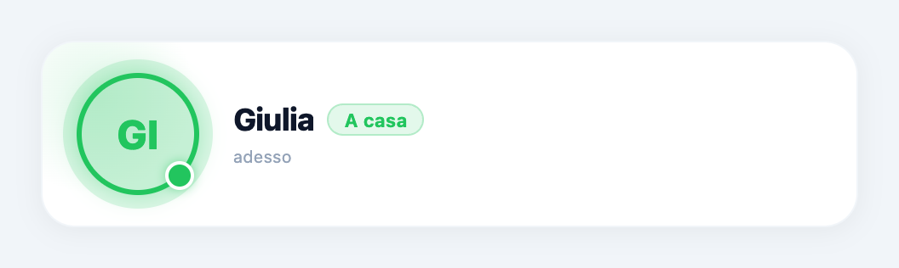
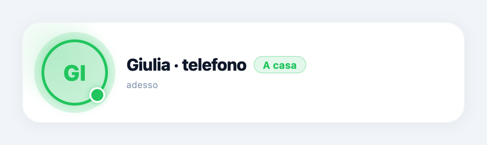
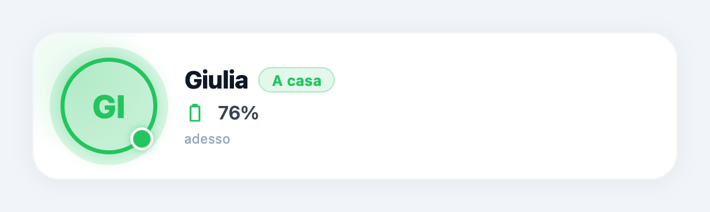
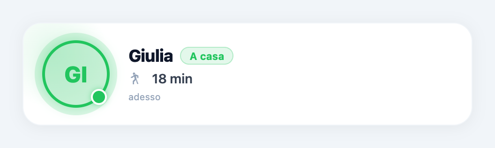
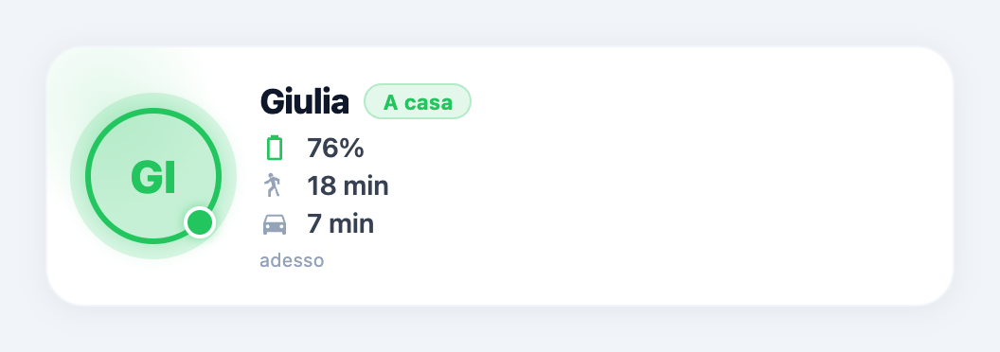
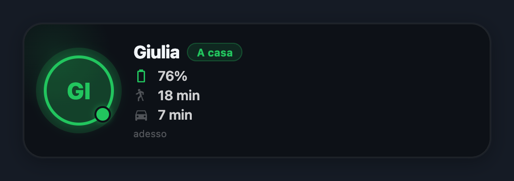

# Persona

La card Persona mostra una persona di Home Assistant con nome, avatar, presenza e, se configurati, batteria del telefono, tempo a piedi e tempo in auto. Può aggiungere una mappa della posizione sullo sfondo.

Riferimento: card `person` **1.3.9**, sorgenti locali esaminati il 13 settembre 2026. Le immagini qui sotto sono render del componente originale con dati dimostrativi e un ambiente SDK isolato; non sono fotografie di una dashboard collegata a Home Assistant. La verifica nella dashboard completa e le immagini della mappa con coordinate restano da completare.

## Configurazione iniziale

1. Apri le impostazioni dell'istanza della card Persona.
2. Nella sezione **Persona**, seleziona **Entità person**, per esempio `person.giulia`.
3. Lascia **Nome (opzionale)** vuoto per utilizzare il nome di Home Assistant, oppure scrivi un nome personalizzato.
4. Aggiungi le metriche desiderate nella sezione **Metriche opzionali**.
5. Per la mappa, attiva il controllo nella sezione **Mappa posizione**. Se la persona non espone coordinate, seleziona un tracker GPS.

È necessaria un'entità `person.*` per visualizzare i contenuti. Le altre entità sono facoltative. La card legge i dati già disponibili in Home Assistant: non crea sensori di batteria, non calcola itinerari e non configura il tracciamento GPS.

## Tutte le opzioni

Queste sono le sette opzioni specifiche della card. Le impostazioni comuni del contenitore, del layout e della dashboard devono essere consultate separatamente.

| Sezione / controllo nell'interfaccia | Valore iniziale | Valori disponibili | Effetto e dipendenze |
| --- | --- | --- | --- |
| Persona → **Entità person** | Nessuna | Entità del dominio `person` | Seleziona la persona da mostrare. Senza selezione compare l'invito a configurare la card. Fornisce stato, nome, foto, ultimo aggiornamento ed eventualmente coordinate. |
| Persona → **Nome (opzionale)** | Vuoto | Testo libero | Sostituisce il nome visualizzato. Se vuoto, usa `friendly_name`, poi l'identificativo dell'entità. Non rinomina la persona in Home Assistant. Senza foto cambia anche le iniziali dell'avatar. |
| Metriche opzionali → **Batteria telefono** | Nessuna | Entità del dominio `sensor` | Aggiunge la riga della batteria. Usa l'unità del sensore; in assenza di unità usa `%`. La riga non appare se il dato è assente, `unknown` o `unavailable`. |
| Metriche opzionali → **Tempo a piedi (es. proximity o travel time)** | Nessuna | Entità del dominio `sensor` | Aggiunge una riga con icona pedone. Mostra il dato del sensore e la sua unità; se questa manca usa ` min`. Non converte distanze o passi in minuti. |
| Metriche opzionali → **Tempo in auto (es. Waze / Google)** | Nessuna | Entità del dominio `sensor` | Aggiunge una riga con icona auto. Mostra il dato del sensore e la sua unità; se questa manca usa ` min`. Non calcola il percorso. |
| Mappa posizione → **Abilita mappa live (retro della card)** | Disattivato | Attivato / disattivato | Abilita lo sfondo Google Maps e l'indicatore Live quando sono disponibili latitudine e longitudine. Nella versione esaminata la mappa è sullo sfondo, prevalentemente a destra: l'etichetta «retro della card» non descrive il comportamento attuale. |
| Mappa posizione → **Sensore GPS (device_tracker)** | Nessuno | Entità del dominio `device_tracker` | Il controllo appare soltanto quando la mappa è abilitata. Usa gli attributi `latitude` e `longitude` del tracker; per ogni coordinata mancante ripiega sull'attributo della persona. Se vuoto usa le coordinate della persona. Non cambia il nome o la presenza mostrati dalla card. |

## Confronti visivi

Ogni confronto parte dalla stessa persona dimostrativa, Giulia, nello stato «A casa». Le varianti 03–07 modificano una sola opzione rispetto alla variante 02. I sensori dimostrativi sono disponibili in tutte le varianti; cambiano soltanto le selezioni nella configurazione.

### Entità person: nessuna → Giulia

Senza entità la card mostra l'invito alla configurazione.

Selezionando la persona compaiono nome, stato, avatar e ultimo aggiornamento. In questo esempio la persona non ha una foto e l'avatar usa le iniziali.

### Nome: automatico → personalizzato

L'unica modifica rispetto alla card base è **Nome (opzionale)**, impostato a «Giulia · telefono».

### Batteria telefono: nessuna → sensore selezionato

Compare la riga con il valore `76%`. Il colore dipende dal valore numerico: verde sopra 50, ambra sopra 20 e fino a 50, rosso fino a 20. Queste soglie sono fisse nella versione esaminata. Per una rappresentazione coerente seleziona un sensore di percentuale batteria.

### Tempo a piedi: nessuno → sensore selezionato

Compare la metrica pedone con `18 min`. L'unità proviene dal sensore dimostrativo.

### Tempo in auto: nessuno → sensore selezionato

Compare la metrica auto con `7 min`.

### Mappa abilitata senza coordinate

Attivare la mappa non basta: senza entrambe le coordinate la card mantiene l'aspetto normale e non mostra l'indicatore Live. Il confronto con una mappa caricata e la variante con tracker GPS dedicato devono ancora essere acquisiti nella dashboard.

## Esempio con tutte le metriche

Seleziona la persona, poi tre sensori appropriati nei campi batteria, tempo a piedi e tempo in auto. Le righe mantengono questo ordine. Lascia la mappa disattivata per una card compatta.

La card segue il tema fornito dalla dashboard. Il tema non è un'ottava opzione nelle impostazioni specifiche della card.

## Come interpreta i dati

- **Presenza:** `home` mostra «A casa» in verde; `not_home` mostra «Fuori» in arancione; stato assente, `unknown` o `unavailable` mostra «Sconosciuto» in grigio. Gli altri stati usano il blu. Nella versione esaminata, per gli altri stati il testo usa prima il `friendly_name` della persona e poi lo stato: il nome della zona potrebbe quindi non comparire.
- **Avatar:** usa `entity_picture` quando disponibile, altrimenti i primi due caratteri del nome in maiuscolo. Non esiste un campo per caricare una foto nelle sette opzioni della card.
- **Metriche:** i valori numerici vengono arrotondati all'intero; gli stati testuali non numerici vengono mostrati come testo. Gli stati sconosciuti o non disponibili nascondono la rispettiva riga.
- **Ultimo aggiornamento:** deriva da `last_updated` della persona, non dal sensore batteria o dal tracker selezionato. Mostra «adesso» sotto 90 secondi, poi minuti, ore o giorni. Il componente non introduce un timer dedicato per aggiornare questa dicitura: viene ricalcolata al render.
- **Mappa:** usa un iframe Google Maps con zoom 15, non regolabile dalle opzioni della card. Le coordinate vengono incluse nell'URL inviato a Google. Per visualizzarla il browser deve poter raggiungere il servizio. L'indicatore Live segnala che la modalità mappa ha coordinate disponibili; non certifica la frequenza o la precisione degli aggiornamenti GPS.

## Problemi frequenti

**La card chiede di configurare un'entità.** Seleziona un elemento nel campo Entità person. La selezione di un tracker GPS non sostituisce la persona.

**La batteria o un tempo non compare.** Controlla che il campo contenga il sensore corretto e che lo stato in Home Assistant non sia assente, `unknown` o `unavailable`.

**Il tempo ha un'unità sbagliata.** Verifica l'unità del sensore. La card la riporta senza conversioni; se non è presente usa minuti come ripiego. I selettori accettano qualsiasi `sensor`, anche se non misura un tempo.

**Ho abilitato la mappa ma non la vedo.** Verifica gli attributi `latitude` e `longitude` della persona o del tracker. Se compare Live ma lo sfondo non carica, verifica l'accesso del browser a Google Maps.

**Ho selezionato un tracker diverso ma nome e stato sono uguali.** È previsto: il tracker dedicato fornisce le coordinate, mentre nome e presenza continuano a provenire dall'entità person.

**Non trovo il comando per girare la card.** Nella versione 1.3.9 esaminata non è implementato un ribaltamento. L'etichetta del controllo mappa contiene ancora il riferimento al retro.

## Stato della verifica

Testo confrontato con `manifest.json`, `src/Settings.jsx`, `src/Card.jsx` e `src/i18n/it.json` della card Persona. Nove render riproducibili del componente originale coprono configurazione assente, selezione persona, nome, tre metriche, mappa senza coordinate, metriche combinate e tema scuro.

Prima della pubblicazione definitiva restano: screenshot dei pannelli impostazioni reali, mappa funzionante con coordinate della persona, tracker dedicato e relativo fallback, controllo mobile nella dashboard e traduzione inglese. Questi passaggi non sono considerati verificati dalle anteprime isolate.
